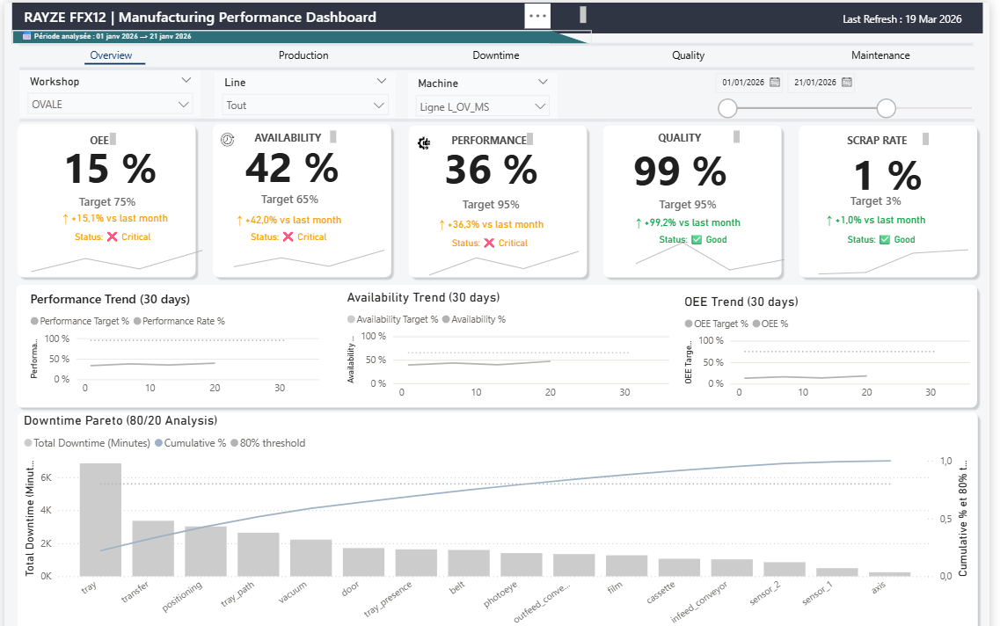
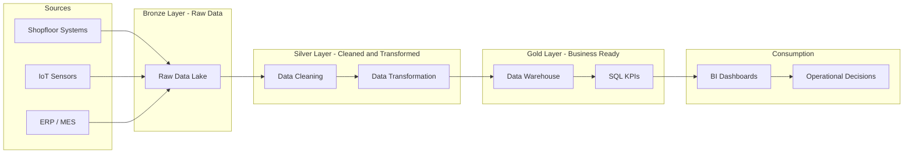

<!-- ========================= -->
<!-- PROJECT STATUS -->
<!-- ========================= -->

[](#versioning)
[](#project-status)
[](#license)

---

<!-- ========================= -->
<!-- TECH STACK -->
<!-- ========================= -->

[](https://www.python.org/)
[](https://www.postgresql.org/)
[](https://www.docker.com/)
[](https://www.microsoft.com/power-platform/products/power-bi)

---

<!-- ========================= -->
<!-- ENGINEERING -->
<!-- ========================= -->

[](#testing)
[](#ci-cd)
[](https://black.readthedocs.io/)
[](https://docs.astral.sh/ruff/)
[](#system-architecture)
[](#configuration)

---

<!-- ========================= -->
<!-- DOMAIN -->
<!-- ========================= -->

[](#data-pipeline)
[](#analytics)

# Industrial Packaging Performance Analytics
### Global Performance Analysis – Dairy Manufacturing Conditioning Department

---

## 🎯 Project Objective

This project implements a **structured, cross-functional performance analysis framework** for industrial packaging workshops.

Key goals:

- Cross-workshop performance benchmarking  
- Line and equipment reliability monitoring  
- Operator and team performance assessment  
- Root cause analysis of production downtime  
- Continuous improvement decision support  

It consolidates **raw operational shopfloor data** into a **centralized analytical model** for industrial steering.

---
## 🚀 Demo

Coming soon...

<p align="center">
  
</p>

## 🏭 Industrial Context

### Sector

Food manufacturing – Dairy packaging operations.

### Workshops

- **Oval lines**, **Camembert lines**, **Portion lines**  

### Equipment

- Stacker / Destacker  
- Wrapping machines  
- Case packers  
- Conveyor systems  

### Shift Organization

- Morning / Evening / Night  
- Weekend (Saturday / Sunday)  

### Theoretical Production Model

- **80 units/min** → **4,800 units/hour** (ideal operation)  

### Downtime Declaration Process

1. System identifies the affected **organ** and **component**  
2. Operator performs corrective action  
3. Event recorded on **shift sheet**  

---

## 📄 Data Sources & Nature

- **Operator shift sheets**, hourly granularity  
- **Production counters**, actual units packaged  
- **Downtime events**, component-level and manual notes  
- **Planned operations**, e.g., breaks, cleaning, warm-up  

**Note:** All repository data are **synthetic mock data**, reflecting realistic operational behavior without exposing sensitive information.

---

## 📉 Downtime Measurement Framework

**Downtime (minutes) = (Theoretical production − Actual production) / Units per minute**  

**Loss categories:**

- Technical stoppages (mechanical, electrical, process)  
- Organizational interruptions (supply, changeovers)  
- Planned operations (breaks, cleaning, warm-up)  
- Maintenance interventions  

---

## 🎯 Scope of Analysis

- All workshops, lines, machines, and components  
- All operational roles (operators, team leads, supervisors)  
- Focus on **systemic performance**, not individual evaluation  

---

## 🧠 Analytical Methodology

1. Operational understanding  
2. Data extraction & structuring  
3. Event normalization & taxonomy standardization  
4. Multi-line/workshop modeling  
5. Downtime quantification & root cause analysis  
6. Cross-sectional comparisons (lines, teams, periods)  
7. KPI & dashboard construction  

---

## 💾 Data Approach

### 1️⃣ Operational Data Model
- Full industrial process representation  
- Links factories, workshops, lines, shifts, production, events  
- Ensures **traceability** and **auditability**  

### 2️⃣ Analytical Layer
- Derived, aggregated, and simplified  
- BI-ready (Power BI, Tableau)  
- Abstracts complexity for operational teams  

---

## 🏗 Analytical Data Warehouse

**Dimensions:**

- `dim_machine` – machine metadata  
- `dim_time` – shift, hour, day, week, month  
- `dim_team` – operators & shifts  
- `dim_organe_element` – components & subcomponents  

**Fact Tables:**

- `fact_hourly_performance` – hourly metrics  
- `fact_production_events` – downtime & root causes  

**Data Flow:**

```text
Raw Data (CSV / Excel)
↓
Python ETL (Clean, Validate, Model)
↓
Processed / Curated Parquet
↓
PostgreSQL Staging → Dimensions → Facts
↓
SQL Analytics Layer (Aggregations, KPIs)
↓
BI Tools (Power BI / Looker / Tableau)
```

## 🏗 System Architecture


## ⚙️ Technology Stack

| Layer | Tools |
|:---|:---|
| Ingestion & ETL | Python, Pandas |
| Storage & Processing | PostgreSQL, Parquet |
| Analysis & Exploration | Jupyter, NumPy |
| Visualization & BI | Power BI, SQL |
| DevOps & Versioning | Git, GitHub, GitHub Actions |

---

## 📊 Key Industrial KPIs

### 1️⃣ Production Efficiency
- **Reliability (%)** = Actual Production / Theoretical Production  
- **Utilization Rate (%)** = (Actual Operating Time / Scheduled Time) × 100  
- **Throughput (units/hour)** = Total units produced / Production hours  

### 2️⃣ Downtime & Availability
- **Downtime (%)** = Total downtime minutes / Total available minutes × 100  
- **Planned vs Unplanned Downtime (%)** = Planned / Unplanned downtime ratio  
- **Mean Time Between Failures (MTBF, min)** = Operating time / Number of failures  
- **Mean Time to Repair (MTTR, min)** = Downtime / Number of failures  

### 3️⃣ Quality Metrics
- **Defect Rate (%)** = Number of defective units / Total units produced × 100  
- **First Pass Yield (FPY, %)** = Units meeting quality standard on first pass / Total units  

### 4️⃣ Operator & Team Performance
- **Operator Efficiency (%)** = Actual output / Expected output per operator  
- **Shift Performance (%)** = Sum of line outputs per shift / Theoretical shift output  

### 5️⃣ Root Cause & Loss Analysis
- **Explained Loss Rate (%)** = Explained downtime / Total downtime  
- **Top 5 Root Causes (%)** = Contribution of main downtime categories to total loss  
- **Pareto Analysis Coverage (%)** = % of total downtime captured by top causes  


---

## 📁 Repository Structure

- `data/` – raw, processed, curated  
- `notebooks/` – analysis & modeling  
- `src/` – Python modules (ingestion, modeling, utils)  
- `sql/` – schemas, tables, queries  
- `docs/` – architecture, data model, KPI definitions  
- `dashboards/` – Power BI files  

---

## 📊 Dashboards Power BI

```text
dashboards/
└── powerbi/
    ├── sales_performance.pbix
    └── screenshots/
```

## 🔄 Pipeline

- Initialize SQL tables

- Load staging

- Build dimensions

- Populate fact tables


## 🚀 Installation
## Installation

### 1️⃣ Clone the repository

```bash
git clone git@github.com:mounkaila-issoufou/industrial-downtime-analytics.gitcd industrial-downtime-analytics
```
### 2️⃣ Create a virtual environment

```bash
```text
python -m venv .venv
```
Activate the environment:

**Windows**

```bash
.\.venv\Scripts\activate
```
**macOS / Linux**

```bash
source .venv/bin/activate
```
### 3️⃣ Install the project (editable mode)

```bash
python -m pip install --upgrade pip
python -m pip install -e .
```
Editable mode (-e) allows local development and CLI usage.

### 🔄 Regenerate dependencies (after updating pyproject.toml)

If you add or modify dependencies in `pyproject.toml`, regenerate the locked `requirements.txt` file with:

```bash
pip install pip-tools
pip-compile pyproject.toml -o requirements.txt
```

This will:

- Resolve all transitive dependencies

- Lock exact versions

- Keep requirements.txt fully synchronized with pyproject.toml

⚠️ Do not edit requirements.txt manually — it is automatically generated.


### 🧱 Database Initialization

Before running the pipeline for the first time:

```bash
industrial-downtime init
```
This command:

- Creates schemas (stg, ops, dw)

- Creates all staging, operational, and data warehouse tables
## Run pipeline

- Prepares the full database structure

### 🔄 Optional – Reset Data

To truncate all data (without dropping tables):
```bash
industrial-downtime reset
```
This clears all data layers while keeping the database structure intact.

### ▶ Run the Data Pipeline

To execute the full end-to-end pipeline:
```bash
industrial-downtime run
```
or

```bash
python -m industrial_downtime.cli run
```
- The pipeline performs:

- Mock industrial data generation

- Staging layer load

- Operational layer transformation

- Data warehouse population

### 🔁 Full Refresh (Reset + Run)

For a complete refresh:

```bash
industrial-downtime full-refresh
```
## 🏗 Execution Flow Overview

```bash
init         → Create schemas & tables
reset        → Truncate data layers
run          → Execute full DML pipeline
full-refresh → Reset + Run
```

### 🧹 Pre-commit hooks (Automatic code checks)

We use `pre-commit` to ensure code quality and consistent formatting before committing. It automatically runs tools like **black** (code formatter) and **ruff** (linter) on your modified files.

#### 1️⃣ Install pre-commit

```bash
pip install pre-commit
```
#### 2️⃣ Add the configuration file

Create a ``.pre-commit-config.yaml`` at the root of your project:

```bash
repos:
  - repo: https://github.com/psf/black
    rev: 24.0
    hooks:
      - id: black

  - repo: https://github.com/charliermarsh/ruff-pre-commit
    rev: v0.0.326
    hooks:
      - id: ruff
```
#### 3️⃣ Activate pre-commit hooks

```bash
pre-commit install
```

This installs the Git hook. From now on, every git commit will automatically check your code.

#### 4️⃣ Usage

Simply work as usual and commit your changes:

```bash
git add .
git commit -m "feat: add new feature"
```

Pre-commit will check and format modified files automatically.

If issues are found, fix them and commit again.

### 5️⃣ Optional: run on all files

To apply hooks to all files in the project (useful when first setting up):

```bash
pre-commit run --all-files

```

## Expected outcomes:

Consolidated performance overview

Root cause analysis of downtime

Cross-line / workshop comparison

Improvement prioritization

---
## 📈 Business Impact Simulation

Based on modeled industrial scenarios:

- 3% OEE improvement → +X units/day
- 10 min MTTR reduction → +Y hours/month recovered
- Top 3 root causes removal → -Z% downtime

## 🧭 Operational Decision Scenarios

Example 1:
If Line A underperforms 3 consecutive shifts → trigger maintenance audit.

Example 2:
If MTBF < threshold → preventive maintenance scheduling.

Example 3:
If weekend performance < weekday performance → workforce adjustment analysis.


## 📚 Documentation

- **Architecture** → docs/architecture_overview.md

- **Star schema** → docs/data_model.md

- **Data dictionary** → docs/data_dictionary.md

- **KPI definitions** → docs/kpi_definitions.md

- **Assumptions & limits** → docs/assumptions_and_limits.md


## ⚠️ Limitations

- Manual data entry, approximate durations

- Hourly granularity

- Micro-stops not always captured

## 🏭 Real Industrial Inspiration

This project structure is inspired by real dairy packaging operations,
including shift-based production monitoring,
TRS calculation,
and component-level downtime tracking.

---

## 🚀 Roadmap — Industrial Data Platform

This project is evolving from a data warehouse prototype into a **production-ready industrial data platform**, designed to integrate with real-world systems such as MES and ERP.

---

### 🎯 Objective

Build a scalable and modular data architecture capable of:

* Integrating industrial data sources (MES, IoT, ERP)
* Supporting both batch and streaming ingestion
* Ensuring data quality, traceability, and reprocessing
* Delivering reliable KPIs (OEE, downtime, quality)

---

### 🧱 Target Architecture

```
Sources (MES / ERP / IoT)
        ↓
Ingestion (Airflow / Kafka)
        ↓
Data Lake (S3 / MinIO)
        ↓
Transformation (dbt)
        ↓
Data Warehouse (PostgreSQL / Snowflake)
        ↓
BI / APIs (Power BI / FastAPI)
```

---

### 🛠️ Planned Tech Stack

| Layer              | Technology                      | Status         |
| ------------------ | ------------------------------- | -------------- |
| Ingestion (Batch)  | Apache Airflow                  | ⏳ Planned      |
| Ingestion (Stream) | Apache Kafka                    | 🔜 Optional    |
| Storage            | MinIO (S3-compatible Data Lake) | ⏳ Planned      |
| Transformation     | dbt                             | 🚧 In Progress |
| Data Warehouse     | PostgreSQL                      | ✅ Current      |
| API Layer          | FastAPI                         | 🔜 Optional    |
| BI / Analytics     | Power BI                        | ✅ Current      |
| Containerization   | Docker                          | ⏳ Planned      |
| Data Quality       | dbt tests / Great Expectations  | ⏳ Planned      |
| Monitoring         | Prometheus + Grafana            | 🔜 Optional    |

---

### 🗺️ Implementation Roadmap

#### Phase 1 — Data Transformation Modernization

* [ ] Migrate SQL pipeline to **dbt**
* [ ] Introduce staging / intermediate / marts layers
* [ ] Add data tests (uniqueness, null checks)

#### Phase 2 — Orchestration

* [ ] Integrate **Airflow** for pipeline scheduling
* [ ] Replace manual execution scripts

#### Phase 3 — Data Lake Integration

* [ ] Add **MinIO** as raw storage layer
* [ ] Store raw events in Parquet format

#### Phase 4 — Containerization

* [ ] Dockerize the full stack (DB, dbt, Airflow)
* [ ] Enable reproducible environments

#### Phase 5 — Advanced Features (Optional)

* [ ] Add Kafka for real-time event streaming
* [ ] Build API layer with FastAPI
* [ ] Implement monitoring (Grafana / Prometheus)

---

### 🧠 Long-Term Vision

Transition toward an **Industry 4.0-ready data platform**, enabling:

* Real-time production monitoring
* Predictive maintenance
* Cross-system analytics (MES × ERP × Quality)
* Scalable and cloud-ready architecture

---


## 👤 Auteur
Industrial Performance & Data Engineering Project
Designed and implemented by:
Production Engineer & Industrial Data Analyst

## Contact & Link

[](https://www.linkedin.com/in/abdoul-m-3a76b5214/)
[](https://github.com/mounkaila-issoufou)
[](mailto:mounkaila.issoufou025@gmail.com)


## 📜 License

MIT License – Free for educational & professional use