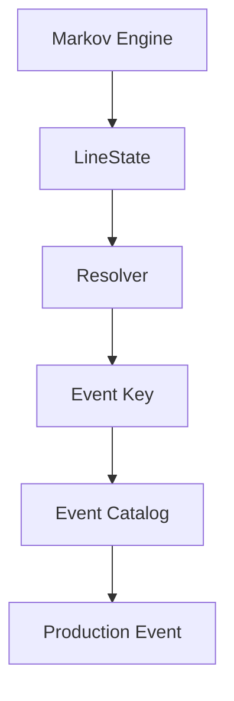
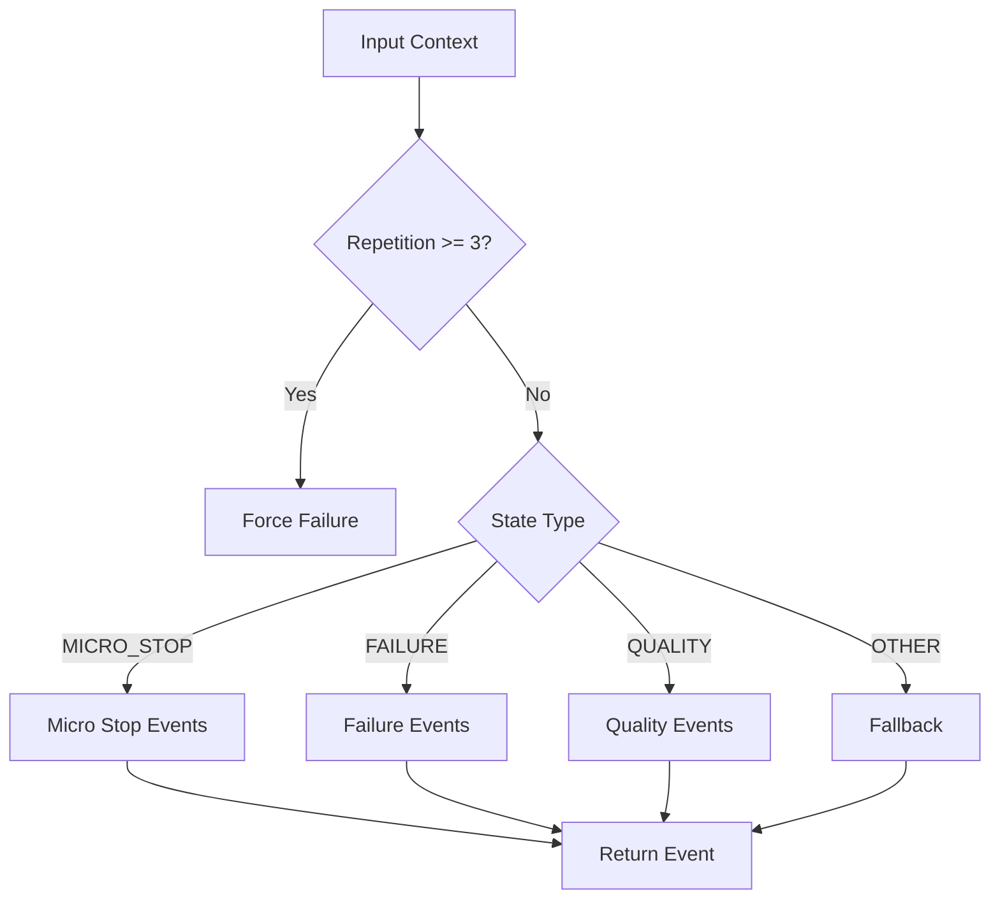

# Industrial Downtime Platform – Resolver Architecture

# 🎯 Objectif

Documenter clairement la logique métier introduite avec le **Resolver** afin de :

* éviter la dérive technique
* centraliser les règles métier
* faciliter l’évolution (Industry 4.0 ready)

---

# 🧠 Vue d’ensemble

## Pipeline logique



---

# 🧱 Architecture des responsabilités

## 1. Markov Engine

Responsable de :

* simuler le comportement machine
* produire des états

Sortie :

```
LineState (RUNNING, MICRO_STOP, FAILURE...)
```

---

## 2. Resolver (🔥 cœur métier)

Responsable de :

* transformer un état en événement métier
* appliquer des règles industrielles
* gérer le contexte

Entrée :

```
ResolutionContext
```

Sortie :

```
ResolvedEvent
```

---

## 3. Event Catalog

Responsable de :

* définir la vérité métier
* contenir les caractéristiques des événements

---

## 4. Generator

Responsable de :

* orchestrer
* construire les données finales
* garantir les invariants (≤ 60 min)

---

# 🧩 ResolutionContext

```python
ResolutionContext(
    state: LineState,
    line: LineConfig,
    shift: Shift,
    repetition_count: int
)
```

---

# ⚙️ Logique interne du Resolver



---

# 🔁 Gestion de la répétition

## Principe

Le système anticipe la répétition avant résolution :

```python
predicted_repetition = repetition_count + 1
```

## Effet métier

| Répétition | Comportement     |
| ---------- | ---------------- |
| 1-2        | normal           |
| ≥ 3        | escalade → panne |

---

# 🔥 Règle métier actuelle

```python
if ctx.repetition_count >= 3:
    return ResolvedEvent(
        event_key="stacker_jam",
        source="resolver_rule_repetition_escalation"
    )
```

---

# 🧠 Philosophie d’architecture

## Avant

```
State → Families → Random Event
```

## Après

```
State → Resolver → Event
```

---

# 🎯 Avantages

* centralisation des règles métier
* extensibilité (facile d’ajouter règles)
* traçabilité (`source`)
* simulation réaliste

---

# 🚀 Évolutions futures

## Court terme

* règles dépendantes de la ligne (robustesse)
* règles dépendantes du shift (nuit vs jour)

## Moyen terme

* suppression complète du hasard
* scoring intelligent des événements

## Long terme

* intégration IA / ML
* prédiction de panne

---

# 📌 Règles d’or

* ❌ jamais mettre de logique métier dans le generator
* ❌ ne pas dupliquer la logique du resolver
* ✅ toute décision métier → resolver

---

# 🧭 Résumé

| Composant | Rôle              |
| --------- | ----------------- |
| Markov    | dynamique machine |
| Resolver  | cerveau métier    |
| Catalog   | vérité métier     |
| Generator | orchestration     |

---

# ✅ Conclusion

Le système est maintenant structuré selon une logique industrielle :

👉 séparation claire entre simulation, décision et exécution.

C’est une base solide pour une plateforme Industry 4.0.
