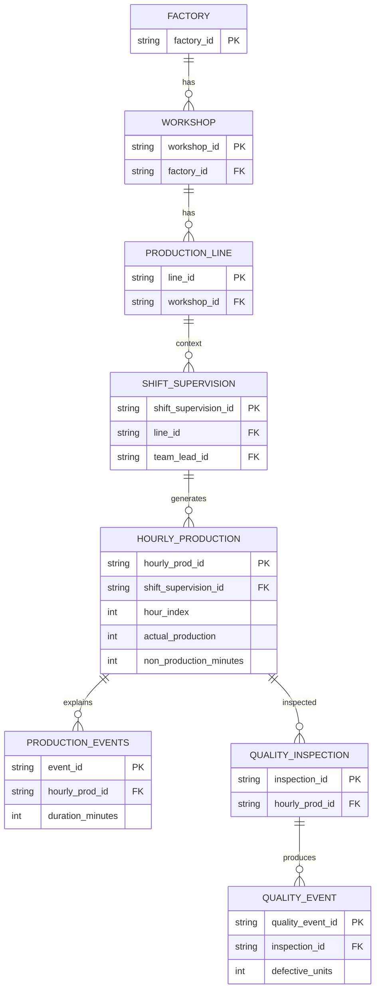

# 📐 Data Model – Industrial Production & Downtime Analytics

---

## 🎯 Objectif du modèle

Ce modèle de données vise à analyser la performance industrielle à partir :

* de la production horaire réelle,
* des arrêts machines détaillés,
* des défauts qualité,
* du contexte humain (opérateurs, chefs d’équipe),
* du contexte temporel (shifts).

👉 Il permet d’expliquer **pourquoi** la production s’écarte du théorique, et pas seulement **combien**.

---

## 🧱 Vue d’ensemble conceptuelle

```text
Factory
└── Workshop
    └── Production_Line
        └── Shift_Supervision
            ├── Shift_Operator_Assignment
            └── Hourly_Production
                ├── Production_Events
                └── Quality_Inspection
                        └── Quality_Events
```

---

# 🏭 SCHÉMA 1 — MODÈLE OPÉRATIONNEL (OPS)

```text
FACTORY
   │
   └── WORKSHOP
         │
         └── PRODUCTION_LINE
               │
               └── SHIFT_SUPERVISION
                       │
       ┌──────────────┼────────────────────────────┐
       │              │                            │
SHIFT_OPERATOR   HOURLY_PRODUCTION        QUALITY_INSPECTION
ASSIGNMENT             │                          │
                       │                          └── QUALITY_EVENTS
                       │
                       └── PRODUCTION_EVENTS
```

---

# 📊 SCHÉMA 2 — MODÈLE ANALYTIQUE (DW)

```text
              DIM_TIME
                  │
DIM_MACHINE ─── FACT_HOURLY_PERFORMANCE ─── DIM_TEAM
                  │
                  │
        FACT_OEE_HOURLY   (pilotage global)
                  │
        FACT_PRODUCTION_EVENTS ─── DIM_ORGANE_ELEMENT
                  │
        FACT_QUALITY_EVENTS ────── DIM_QUALITY_DEFECT
```

---

# 🧠 PRINCIPES FONDAMENTAUX

* séparation stricte **OPS vs DW**
* grain principal = **heure × machine × équipe**
* modèle en **schéma en étoile**
* historisation via dimensions (SCD)
* orientation BI (Power BI / SQL)

---

# 📏 GRAIN DES TABLES (🔥 CRITIQUE)

| Table                   | Grain                          |
| ----------------------- | ------------------------------ |
| hourly_production       | 1 heure × 1 ligne × 1 équipe   |
| production_events       | 1 événement                    |
| quality_events          | 1 défaut                       |
| fact_hourly_performance | 1 heure × 1 machine × 1 équipe |
| fact_production_events  | 1 événement                    |
| fact_quality_events     | 1 défaut                       |
| fact_oee_hourly         | 1 heure × 1 machine × 1 équipe |

👉 ⚠️ Toute erreur de grain = duplication / KPI faux

---

# 🏭 MODÈLE OPÉRATIONNEL (ERD)



---

# 📊 MODÈLE ANALYTIQUE (STAR SCHEMA)

---

## 📐 DIMENSIONS

### ⏱ DIM_TIME

* clé : `time_key = YYYYMMDDHH`
* support des analyses temporelles

---

### 🏭 DIM_MACHINE

* représente une ligne de production
* contient attributs métier (capacité, statut)

---

### 👥 DIM_TEAM ⚠️

* dépend du **shift + ligne**
* source fréquente de duplication
* nécessite contrôle du grain

---

### 🧩 DIM_ORGANE_ELEMENT

* permet analyse des causes machine

---

### ❌ DIM_QUALITY_DEFECT

* normalisation des défauts qualité
* clé composite métier (category + family + type)

---

## 📈 TABLES DE FAITS

---

### ⚡ FACT_HOURLY_PERFORMANCE

👉 table principale (pilotage)

* production
* downtime
* ratios

---

### 🚨 FACT_PRODUCTION_EVENTS

👉 diagnostic des pertes

* granularité fine
* analyse root cause

---

### 🔍 FACT_QUALITY_EVENTS

👉 analyse qualité

* défauts
* scrap
* rework

👉 ⚠️ **non agrégée (grain événement)**

---

### 🏆 FACT_OEE_HOURLY

👉 KPI business final

| KPI          | Description            |
| ------------ | ---------------------- |
| Availability | Temps disponible       |
| Performance  | Production vs capacité |
| Quality      | Bon / Total            |
| OEE          | Produit des 3          |

---

# 📊 KPI INDUSTRIELS

---

## Availability

```
(60 - non_production_minutes) / 60
```

---

## Performance

```
actual_production / theoretical_production
```

---

## Quality

```
(actual - defects) / actual
```

---

## OEE

```
Availability × Performance × Quality
```

---

# ⚠️ PIÈGES IDENTIFIÉS (RETOUR EXPÉRIENCE)

* ❌ mauvais JOIN → duplication massive
* ❌ dimension team mal définie → explosion lignes
* ❌ SUM sur données déjà agrégées → incohérence
* ❌ grain qualité ≠ grain production
* ❌ partitions manquantes → erreurs SQL

---

# 🛡️ BONNES PRATIQUES

* contrôle du grain à chaque étape
* validation OPS → DW (row count check)
* idempotence (`ON CONFLICT`)
* séparation logique / analytique
* tests KPI

---

# 📊 CAS D’USAGE ANALYTIQUES

* OEE par ligne / atelier
* Pareto des causes (80/20)
* analyse des pertes
* performance par équipe
* impact qualité sur production
* trend temporel

---

# 📌 LIMITES

* données simulées
* qualité dépend du générateur
* micro-arrêts partiellement modélisés
* simplification du comportement humain

---

# ✅ CONCLUSION

Ce modèle fournit une base :

* robuste
* scalable
* orientée métier

👉 adaptée à :

* data engineering industriel
* BI (Power BI)
* amélioration continue (lean / OEE)
