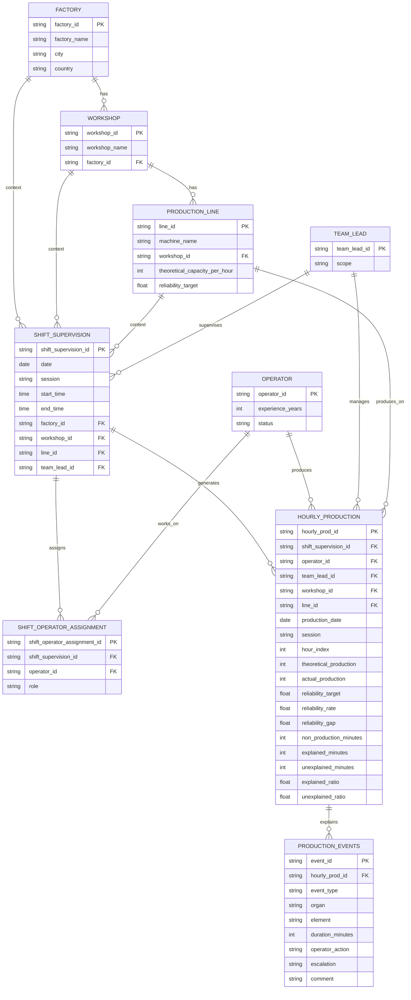
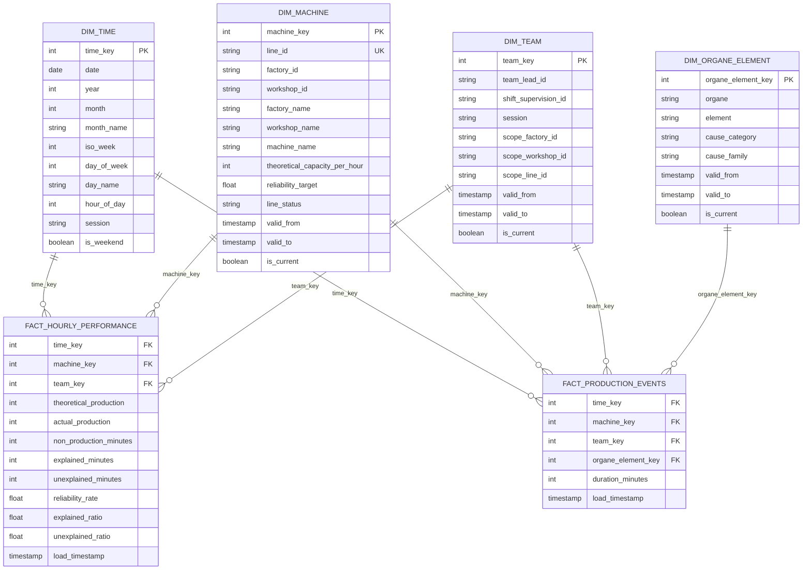

# 📐 Data Model – Industrial Production & Downtime Analytics

## 🎯 Objectif du modèle
Ce modèle de données vise à analyser la performance industrielle à partir :
- de la production horaire réelle,
- des arrêts machines détaillés,
- du contexte humain (opérateurs, chefs d’équipe),
- du contexte temporel (shifts).

Il permet d’expliquer **pourquoi** la production s’écarte du théorique, et pas seulement **combien**.

---

## 🧱 Vue d’ensemble conceptuelle

```text
Factory
└── Workshop
└── Production_Line
└── Shift_Supervision
├── Shift_Operator_Assignment
└── Hourly_Production
└── Production_Events
```
## SCHÉMA 1 — MODÈLE OPÉRATIONNEL
```text
FACTORY
   │
   └── WORKSHOP
         │
         └── PRODUCTION_LINE
               │
               └── SHIFT_SUPERVISION  (DIMENSION DE CONTEXTE)
                       │
       ┌──────────────┼───────────────────────┐
       │                              │
SHIFT_OPERATOR_ASSIGNMENT      HOURLY_PRODUCTION  (FAIT)
                                      │
                                      └── PRODUCTION_EVENTS (FAIT)

```

## SCHÉMA 2 — MODÈLE ANALYTIQUE
```text
              DIM_TIME
                  │
DIM_MACHINE ─── FACT_HOURLY_PERFORMANCE   (pilotage global)
                  │
                  │
         FACT_PRODUCTION_EVENTS (diagnostic détaillé)
                  │
          DIM_ORGANE_ELEMENT


```
Le modèle est :
- relationnel
- orienté faits
- historisable
- compatible BI (Power BI / SQL / Python)

---

## 🏭 Dimensions de structure



## 🧠 Principes analytiques supplémentaires

- séparation claire entre modèle opérationnel et modèle analytique,
- agrégation horaire comme grain principal,
- traçabilité entre production et événements,
- compatibilité native avec Power BI / Tableau / SQL,
- évolutivité vers TRS (OEE), qualité et maintenance prédictive.


---
## 🧠 Couche analytique cible (BI-friendly)

Au-dessus du modèle opérationnel, une couche analytique en schéma en étoile est construite pour les usages BI.

### Dimensions
- dim_machine  
- dim_time  
- dim_team  
- dim_organe_element  


### Fait principal
- fact_hourly_performance  
- fact_production_events




Cette couche permet :
- analyses rapides en SQL,
- modèles Power BI performants,
- comparaisons transverses (atelier, ligne, équipe, période).


## 📌 Cas d’analyse rendus possibles

- Fiabilité par ligne, atelier, site
- Analyse des arrêts par organe / élément
- Comparaison des performances par shift
- Impact des chefs d’équipe
- Pareto des causes de non-production

---

## ⚠️ Hypothèses et limites
- Un opérateur est affecté à un seul shift à la fois
- Les événements expliquent la non-production d’une heure donnée
- Les objectifs de fiabilité sont définis par ligne
- Les durées d’intervention sont estimées manuellement.
- Les micro-arrêts peuvent ne pas être tracés.
- La qualité des analyses dépend de la rigueur de saisie terrain.

Ces limites sont documentées et prises en compte dans l’interprétation.

---
## ✅ Conclusion

Ce modèle de données fournit une base **robuste, scalable et compréhensible** pour l’analyse de la performance industrielle.

Il est adapté à :
- un contexte multi-usines,
- un usage analytique avancé,
- une démarche d’amélioration continue pilotée par la donnée.
